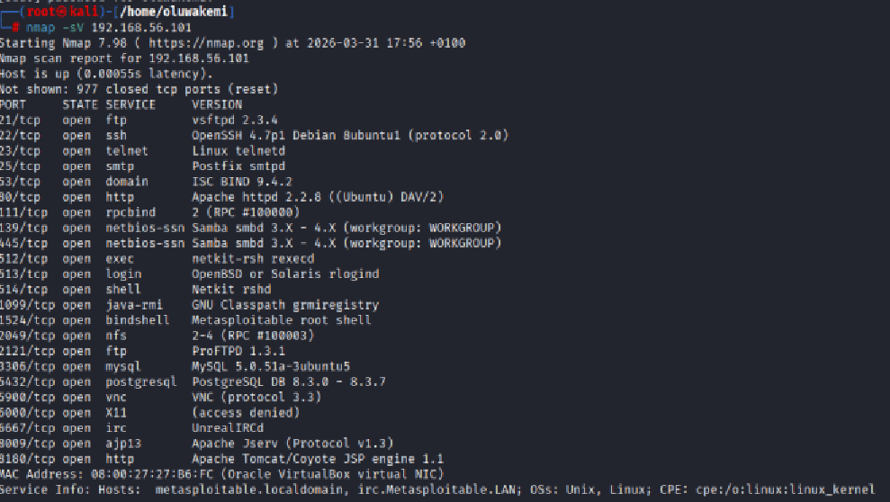

# Kali Linux Security Lab Portfolio

## Overview
This repository documents my hands-on cybersecurity lab practice using Kali Linux, Metasploit, Nmap, and Metasploitable 2.

The goal of this project is to simulate real-world vulnerability assessment and penetration testing workflows in a safe lab environment.

## Tools Used
- Kali Linux
- Nmap
- Metasploit Framework
- Metasploitable 2
- Oracle VirtualBox

## Lab Objectives
- Perform host discovery
- Scan open ports
- Identify services
- Enumerate vulnerabilities
- Perform controlled exploitation
- Capture evidence
- Write remediation reports

## Repository Structure
- `nmap-scans/` → network scan notes
- `metasploit-labs/` → exploitation labs
- `screenshots/` → proof of work
- `reports/` → findings and fixes

## Skills Demonstrated
- Network reconnaissance
- Port scanning
- Vulnerability assessment
- Exploitation basics
- Security documentation
- Remediation reporting

## Author
**Oluwakemi Bankole**  
Cybersecurity Analyst | Pentesting Trainee

# Kali Linux Home Lab | Network Reconnaissance & Exploitation

> Hands-on cybersecurity lab demonstrating reconnaissance, service enumeration, exploitation, and web application testing in a controlled Kali Linux environment.

---

## Project Overview
This repository documents a full cybersecurity home lab workflow from network discovery to exploitation and post-exploitation.

### Skills Demonstrated
- Network scanning
- Port enumeration
- Service identification
- Vulnerability discovery
- Metasploit exploitation
- DVWA testing
- Command injection
- File upload web shell
- Documentation and reporting

### Tools Used
- Kali Linux
- Nmap
- Metasploit Framework
- DVWA
- Linux CLI
